# Part 2: TrueSkill Demystified

*The Xbox matchmaking algorithm, applied to jewelry*

***

## Quick History: Elo and Its Problems

TrueSkill came from Elo,[^1] the chess rating system from the 1960s. Elo's idea: give everyone a number, update it when they play, let the numbers converge to true skill over time.

Simple, but it has problems:

* **New players are wild cards**: A fresh account could be a grandmaster or a total beginner. Elo has no way to express this uncertainty.
* **No confidence tracking**: Someone rated 1500 after 3 games is very different from 1500 after 1000 games. Elo treats them the same.
* **Draws are awkward**: The original system wasn't really designed for ties.

In 2007, Microsoft Research built **TrueSkill**[^2] to fix this for Xbox Live. It powers Halo and Gears of War matchmaking.

Turns out it works great for ranking pendants too.

***

## Two Numbers, Not One

The key difference from Elo: TrueSkill tracks *two* things about each item.

| Symbol   | What it is           | What it means                        |
| -------- | -------------------- | ------------------------------------ |
| $\mu$    | Mean                 | Best guess at how much you like this |
| $\sigma$ | Standard deviation   | How uncertain we are about that guess |

New pendant enters the system? We start with:

```Python
μ = 25.0   # Middle of the range
σ = 8.333  # No idea if you'll love it or hate it
```

That high $\sigma$ is the system saying "could be anywhere."

```mermaid
---
title: "New Pendant: Initial State"
---
graph LR
    subgraph "New Pendant"
        A["μ = 25.0<br/>σ = 8.333"]
    end
    
    subgraph "What this means"
        B["🔔 Wide bell curve<br/>Could be anywhere from ~0 to ~50"]
    end
    
    A --> B
```



*Figure 1: A new pendant enters the system with high uncertainty. The Gaussian prior is centered at $\mu = 25$ with $\sigma = 8.333$, representing our lack of prior knowledge about user preference.*

***

## Every Comparison Shrinks Uncertainty

Here's the neat part. When two pendants compete, **both** get more certain.

You pick A over B. What did we learn?

* A is probably better than we thought
* B is probably worse than we thought
* And we're more confident about *both* now, regardless of who won

```mermaid
---
title: "After One Comparison"
---
flowchart TD
    subgraph Before["Before"]
        A1["Pendant A<br/>μ = 25.0, σ = 8.3"]
        B1["Pendant B<br/>μ = 25.0, σ = 8.3"]
    end
    
    Compare["You pick A"]
    
    subgraph After["After"]
        A2["Pendant A<br/>μ = 29.4, σ = 6.5 ⬇️"]
        B2["Pendant B<br/>μ = 20.6, σ = 6.5 ⬇️"]
    end
    
    A1 --> Compare
    B1 --> Compare
    Compare --> A2
    Compare --> B2
    
    style A2 fill:#90EE90
    style B2 fill:#FFB6C1
```



*Figure 2: A single comparison updates both pendants. The preferred item's $\mu$ increases while the other's decreases—and crucially, both $\sigma$ values shrink.*

One comparison: $\mu$ values diverge, $\sigma$ values shrink.[^3] That's Bayesian inference doing its thing.

***

## The Code is Simple

```Python
ratingL, ratingR = create_ratings(pendantL, pendantR)
if user_chose_left:
    new_ratingL, new_ratingR = trueskill.rate_1vs1(ratingL, ratingR)
else:
    new_ratingR, new_ratingL = trueskill.rate_1vs1(ratingR, ratingL)
```

`rate_1vs1()` handles all the Gaussian math. Factor graphs, message passing, belief propagation[^2]—you don't have to think about it.

***

## The Lucky Winner Problem

What if a pendant wins once by accident and looks great?

Pendant X: compared once, won. Now $\mu = 29.4$, $\sigma = 6.5$.

Pendant Y: compared 20 times, won 15. Now $\mu = 32.1$, $\sigma = 2.1$.

If we rank by $\mu$ alone, Y beats X. Good.

But what if X just got lucky? With $\sigma = 6.5$, its true appeal could easily be much lower.

**The fix: conservative score.**

$$
\text{Conservative Score} = \mu - 3\sigma
$$

This is roughly a 99.7% confidence lower bound. Pessimistic, but stable.


*Figure 3: The conservative score penalizes uncertainty. Pendant Y, with lower $\sigma$, outranks the "lucky" Pendant X despite X having fewer comparisons.*

The conservative score penalizes uncertainty. You have to *prove* you're good through multiple comparisons—one win doesn't cut it.

Think of $\mu - 3\sigma$ as: "the appeal level this item is almost certainly *at least* as good as." Safe for leaderboards.

***

## Surprises Get Bigger Updates

Not all comparisons teach us the same amount. Expected outcomes? Small adjustments. Surprises? Big updates.

Makes sense: if the pendant with $\mu = 30$ beats the one with $\mu = 20$, that just confirms what we already thought. Small tweak.

But if the $\mu = 20$ underdog *wins*? Now that's information:

* Underdog's $\mu$ jumps up (you like it more than we thought)
* Favorite's $\mu$ drops (not as appealing as we believed)  
* Both $\sigma$ values shrink (definitive preference = strong evidence)

This means TrueSkill learns faster from surprising choices. New pendant beats several established favorites? The algorithm catches on fast.

***

## Draws Work Too

Sometimes you genuinely can't decide. That's fine—TrueSkill handles draws.

A draw means the items are close in appeal. This:

* **Pulls $\mu$ values toward each other** (if they were different)
* **Shrinks $\sigma$ for both** (we still learned something)

The `draw_probability` parameter (0.10 in our setup) tells TrueSkill how common draws are, which affects how much info a draw conveys.

***

## The Full Flow

Here's what happens during a comparison:

```mermaid
---
title: "Match Processing"
---
flowchart TD
    Start["Two pendants shown"] --> Choice
    
    Choice{"User picks"}
    Choice -->|"Left"| LeftWins["Outcome: L"]
    Choice -->|"Right"| RightWins["Outcome: R"]
    Choice -->|"Draw"| Draw["Outcome: D"]
    Choice -->|"Skip"| Skip["Outcome: S"]
    
    LeftWins --> Update
    RightWins --> Update
    Draw --> Update
    Skip --> NoUpdate["No rating change"]
    
    Update["TrueSkill Update<br/>rate_1vs1()"]
    
    Update --> NewBeliefs["New μ and σ<br/>for both"]
    
    NewBeliefs --> Persist["Save to database"]
    NoUpdate --> Persist
    
    Persist --> Next["Pick next pair<br/>(Part 3!)"]
    
    style Update fill:#4169E1,color:white
    style NewBeliefs fill:#90EE90
```



*Figure 4: The complete flow from user decision to database persistence. "Skip" doesn't update ratings—it's for pairs where neither option is acceptable.*

***

## The Match History

Every comparison creates a record:


*Figure 5: The recent matches panel shows comparison history with outcomes (Left/Right/Draw/Skip) and timestamps.*

After a few dozen comparisons, you can see patterns forming.

This raises some questions:

1. **How do we rank with noisy preferences?** (Conservative score handles this)
2. **Which pairs should we show next?** (Not yet solved)
3. **How do we avoid showing the same pair twice?** (Not yet solved)
4. **What if we keep cycling the same top 2 items?** (Loop hell!)

TrueSkill solves #1. But picking which pairs to compare? That's a separate problem—and it's critical.

Part 3 tackles that.

***

## Summary

TrueSkill gives us:

| Feature                        | Why It Matters                        |
| ------------------------------ | ------------------------------------- |
| Two numbers ($\mu$, $\sigma$)  | Track appeal and confidence together  |
| Bayesian updates               | Learn from every comparison           |
| Shrinking $\sigma$             | Uncertainty drops with evidence       |
| Conservative score             | Don't trust lucky first impressions   |
| Draw handling                  | "Can't decide" is still useful data   |

But we've been glossing over something: **which pairs should we compare?**

With 237 pendants and limited patience, random comparisons won't cut it. We need to be smart about which pairs will teach us the most.

That's active learning. And that's Part 3.

***

## References

[^1]: Elo, A. E. (1978). *The Rating of Chessplayers, Past and Present*. Arco Publishing.

[^2]: Herbrich, R., Minka, T., & Graepel, T. (2007). "TrueSkill™: A Bayesian Skill Rating System." *Advances in Neural Information Processing Systems*, 19. Microsoft Research.

[^3]: The conservative score is related to UCB (upper confidence bound) methods in bandit problems—except here we want the *lower* bound for stable rankings.

***

*Next up:* *[Part 3 - The Pair Selection Puzzle](./part3-pair-selection-puzzle.md)*

*Previous:* *[Part 1 - The Pendant Problem](./part1-the-pendant-problem.md)*
