# Part 3: The Pair Selection Puzzle

*Asking the right questions when you can't ask them all*

---

## Where We Left Off

[Part 1](./part1-the-pendant-problem.md) set up the problem: 237 pendants, pairwise comparisons. [Part 2](./part2-trueskill-demystified.md) covered TrueSkill—how $\mu$ tracks estimated appeal and $\sigma$ tracks uncertainty.

Now the real question: **which pairs should we actually compare?**

---

## The Explore-Exploit Problem

Twenty comparisons in, the app knows a few things:

- **Pendant #47** (rose gold teardrop) has won 6 of 7 matches. Looking good.
- **Pendant #183** has never been compared. Complete mystery.
- **Pendant #12** has mixed results across 5 comparisons. Meh confidence.

What should we show next?

**Option A: Exploit**  
Compare #47 against its closest rivals. Nail down the top of the ranking.

**Option B: Explore**  
Compare #183 (never seen) against something. Maybe it's a hidden gem?

Classic exploration-exploitation tradeoff.[^1]

```mermaid
---
title: "The Explore-Exploit Tradeoff"
---
graph TD
    subgraph Exploit["🎯 Exploit"]
        E1["Compare top contenders"]
        E2["Refine the leaderboard"]
        E3["Risk: Miss hidden gems"]
    end
    
    subgraph Explore["🔍 Explore"]
        X1["Compare uncertain items"]
        X2["Find new favorites"]
        X3["Risk: Waste time on junk"]
    end
    
    Balance["⚖️ Balance"]
    
    Exploit --> Balance
    Explore --> Balance
    Balance --> Win["Fast convergence + no blind spots"]
    
    style Balance fill:#FFD700
```



*Figure 1: The fundamental tradeoff. Pure exploitation might miss better options; pure exploration wastes comparisons on known mediocre items.*

Too much exploitation → miss better options hiding in the unexplored pile.

Too much exploration → waste comparisons on stuff you already know is mediocre.

We need a principled way to balance.

---

## The Obvious Ideas (And Why They Fail)

**Random pairs**: Just pick any two.

- ❌ Wastes comparisons on items we already understand
- ❌ Shows obviously mismatched pairs (uninformative)
- ❌ Repeats the same pair too often

**Round-robin**: Always compare items with the fewest comparisons.

- ✅ Every item gets exposure
- ❌ Doesn't care about match quality (#1 vs #200 teaches nothing)
- ❌ Ignores uncertainty—some items need more matches than others

**Similar-$\mu$ heuristic**: Compare items with close mean values.

- ✅ Close matches are informative
- ❌ Ignores uncertainty ($\sigma$)
- ❌ Gets stuck on the same competitive pairs
- ❌ Never explores new items

We need something smarter.

---

## $E[\Delta\sigma]$: Expected Uncertainty Reduction

Here's the insight from Bayesian active learning: pick the pair that teaches us the most.

But "teaches us the most" is vague. How do we measure it?

**Answer: measure how much uncertainty will shrink.**

For any pair (i, j), compute the **expected $\Delta\sigma$**—the expected reduction in total uncertainty after comparing them.

$$
E[\Delta\sigma]_{i,j} = \sum_{y \in \{L, R, D\}} P(y) \cdot \Delta\sigma_y
$$

Where:

- $y$ is the outcome: Left wins (L), Right wins (R), Draw (D)
- $P(y)$ is the probability of that outcome
- $\Delta\sigma_y$ is how much uncertainty drops if that outcome happens

### How to Compute It

TrueSkill gives us the tools. For pendants with ratings $(\mu_L, \sigma_L)$ and $(\mu_R, \sigma_R)$:

1. **Get outcome probabilities**: TrueSkill predicts $P(\text{Left wins})$, $P(\text{Right wins})$, $P(\text{Draw})$ based on the $\mu$ gap and combined uncertainty.

2. **Simulate each outcome**: Run the TrueSkill update for each possible result to see what $\sigma$ values would become.

3. **Take the expectation**:
   $$E[\Delta\sigma] = \sum_{y} P(y) \cdot (\sigma_\text{before} - \sigma_\text{after}(y))$$

### Why It Works

This formula captures what we want:

| Situation | $E[\Delta\sigma]$ | Why |
|-----------|-------------------|-----|
| Both items uncertain | **High** | Lots of uncertainty to reduce |
| One item uncertain | **Medium** | Still something to learn |
| Both items well-known | **Low** | Not much uncertainty left |
| Close match (similar $\mu$) | **Higher** | Uncertain outcome = balanced learning |
| Lopsided match | **Lower** | Predictable outcome = less info |

No heuristics or special cases. The math just does the right thing.

```mermaid
graph TD
    subgraph High["High E[Δσ] Pairs"]
        H1["Both pendants uncertain"]
        H2["Similar estimated appeal"]
        H3["→ Compare these first"]
    end
    
    subgraph Low["Low E[Δσ] Pairs"]
        L1["Both pendants well-measured"]
        L2["Very different appeal levels"]
        L3["→ Skip these"]
    end
    
    H1 --> Priority["🎯 Selection Priority"]
    L1 --> Priority
    
    style High fill:#90EE90
    style Low fill:#FFB6C1
```



---

## Thompson Sampling: Randomness on Purpose

$E[\Delta\sigma]$ is great, but it's deterministic. Same state → same pair every time.

That causes problems:

- Gets stuck in loops
- Over-focuses on a small set of "most informative" pairs
- Misses items that *would* be informative with a bit more exploration

Enter **Thompson Sampling**, an algorithm from 1933 (!) that's still one of the best explore-exploit balancers we have.

### How It Works

1. For each pendant, **sample** an appeal value from its posterior: $\text{sample} \sim \mathcal{N}(\mu, \sigma^2)$
2. Sort pendants by sampled appeal
3. Look at adjacent pairs in this sampled ranking
4. Score those pairs by $E[\Delta\sigma]$, pick the best

### Why It's Clever

The sampling is the key:

- **High-$\sigma$ items** → wide distributions → samples bounce around wildly
- Sometimes they sample high (top of ranking), sometimes low (bottom)
- They naturally end up in more comparisons

- **Low-$\sigma$ items** → narrow distributions → samples stay consistent
- They hold their position
- Only get compared when they're actually competitive


*Figure 2: High-uncertainty items have wide posterior distributions, causing their samples to fluctuate. This naturally leads to more exploration of uncertain items.*

Thompson Sampling is a natural explore-exploit balance: uncertain items get explored, certain items only compete when relevant.

---

## The Hybrid: Best of Both

Pure $E[\Delta\sigma]$ is too greedy. Pure Thompson is too random.

So we combine them:

```python
if random() < 0.25:
    candidates = thompson_sample_pairs()  # Sample from posteriors
else:
    candidates = all_pairs()              # All O(n²) pairs

best = max(candidates, key=expected_sigma_reduction)
return best
```

- **75% of the time**: Greedy $E[\Delta\sigma]$ on all pairs
- **25% of the time**: Thompson generates candidates, then $E[\Delta\sigma]$ picks the best

This gives us efficiency from the greedy approach, exploration from Thompson, and no loops.

```mermaid
flowchart TD
    Start["Select next pair"] --> Roll{"Random < 0.25?"}
    
    Roll -->|"Yes (25%)"| Thompson["Thompson Sampling<br/>Sample, find adjacent pairs"]
    Roll -->|"No (75%)"| AllPairs["Consider all pairs"]
    
    Thompson --> Candidates["Candidate pairs"]
    AllPairs --> Candidates
    
    Candidates --> Score["Score by E[Δσ]"]
    Score --> Best["Pick highest"]
    
    Best --> Exclude{"Recently skipped?"}
    Exclude -->|"Yes"| Next["Try next best"]
    Exclude -->|"No"| Return["Return pair"]
    Next --> Exclude
    
    style Thompson fill:#FFD700
    style Score fill:#4169E1,color:white
    style Return fill:#90EE90
```



*Figure 3: The hybrid selection algorithm. 75% of comparisons use greedy $E[\Delta\sigma]$ optimization; 25% use Thompson Sampling to avoid local optima.*

---

## Cooldowns for Skips and Draws

One more thing: if you skip a pair or call it a draw, we exclude that pair from the next 2 rounds. Prevents annoying repeats while still letting informative pairs resurface later.

---

## The Complete Flow

Putting it together:

```mermaid
flowchart TD
    subgraph Init["Setup"]
        I1["Load all pendants"]
        I2["Need at least 2"]
    end
    
    subgraph Policy["Which approach?"]
        P1{"Hybrid mode"}
        P2["Roll: Thompson vs E[Δσ]"]
    end
    
    subgraph Candidates["Generate candidates"]
        C1["Thompson: sample posteriors,<br/>find adjacent pairs"]
        C2["E[Δσ]: all O(n²) pairs"]
    end
    
    subgraph Scoring["Score and filter"]
        S1["Compute E[Δσ] for each"]
        S2["Sort descending"]
        S3["Apply cooldown filter"]
        S4["Apply repeat penalty"]
        S5["Pick top pair"]
    end
    
    subgraph Output["Done"]
        O1["Return (pendant_A, pendant_B)"]
    end
    
    I1 --> I2
    I2 --> P1
    P1 -->|"ts_prob=0.25"| P2
    P2 -->|"< 0.25"| C1
    P2 -->|">= 0.25"| C2
    C1 --> S1
    C2 --> S1
    S1 --> S2
    S2 --> S3
    S3 --> S4
    S4 --> S5
    S5 --> O1
```



*Figure 4: The complete pair selection algorithm, from initialization through scoring and filtering.*

---

## Does It Actually Work?

I tested the hybrid approach on my 237 pendants.

**Before (random pairs)**:

- 100+ comparisons before rankings stabilized
- Kept showing obviously mismatched pairs
- Top 3 kept changing after 80 comparisons

**After (hybrid $E[\Delta\sigma]$ + Thompson)**:

- ~50 comparisons to stable top 10
- Pairs felt meaningful—close calls that were hard to decide
- Top 3 locked in by comparison #45

Every pair feels like it matters. No more wasted clicks.


*Figure 5: The final leaderboard, ranked by conservative score ($\mu - 3\sigma$). The top 3 are clearly separated with high confidence after just 47 comparisons.*

---

## Summary

1. **$E[\Delta\sigma]$ is the gold standard** for active learning in pairwise ranking. It directly measures expected information gain.

2. **Thompson Sampling adds healthy randomness** by sampling from posteriors, naturally balancing exploration and exploitation.

3. **The hybrid** (75% $E[\Delta\sigma]$, 25% Thompson) combines their strengths.

4. **TrueSkill does the heavy lifting**. `quality_1vs1()` and `rate_1vs1()` handle all the probabilistic reasoning.

5. **Cooldowns prevent annoyance**. Nobody wants to see the same pair twice after skipping.

---

## Epilogue

After 47 comparisons, the app converged. My top 3:

1. 🥇 Rose gold teardrop with subtle diamond accent
2. 🥈 Minimalist gold circle (surprisingly close)
3. 🥉 Vintage-inspired cameo with modern twist

Went with #1. Valentine's Day was saved.

And somewhere in there, I learned more about Bayesian statistics than any textbook taught me. Sometimes the best way to learn is to have a problem you actually care about.

---

## References

[^1]: Sutton, R. S., & Barto, A. G. (2018). *Reinforcement Learning: An Introduction* (2nd ed.). MIT Press. The explore-exploit tradeoff is foundational in bandit problems and sequential decision making.

---

*Source code: [github.com/hugocool/product_picker](https://github.com/hugocool/product_picker)*

*Previous: [Part 2 - TrueSkill Demystified](./part2-trueskill-demystified.md)*

*Start from the beginning: [Part 1 - The Pendant Problem](./part1-the-pendant-problem.md)*
